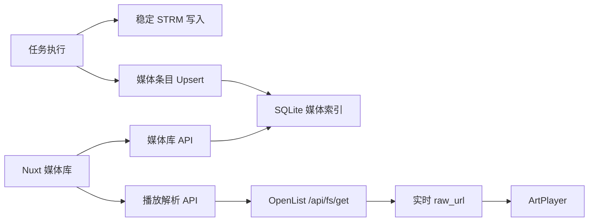

# 媒体库技术设计

Feature Name: media-library
Updated: 2026-08-12

## Description

媒体库以现有任务执行结果为数据源，为每个成功生成的 STRM 文件创建索引。索引保存 OpenList 配置 ID 和远端源路径，播放时通过 OpenList `/api/fs/get` 获取最新 `raw_url`。前端采用独立的媒体库、详情和播放路由，播放器使用 ArtPlayer。

## Architecture

## Components and Interfaces

- `StrmFileService`：统一移除 STRM 地址的查询参数和片段。
- `MediaLibraryService`：媒体条目 Upsert、分页查询、详情查询和播放地址解析。
- `MediaLibraryItemMapper`：按 `task_id + source_path` 幂等持久化媒体条目。
- `OpenlistApiService.resolveRawUrl`：携带后端保存的 OpenList Token 调用 `/api/fs/get`。
- `MediaLibraryController`：提供列表、详情、任务筛选项和播放解析接口。
- `MediaCard`：保持固定海报比例并展示核心元数据。
- `ArtPlayer` 页面：先通过认证 API 获取实时地址，再初始化播放器。

## Data Models

`media_library_item` 保存以下核心数据：

- 来源：`task_id`、`openlist_config_id`、`source_path`、`strm_path`、`source_file_name`
- 分类：`media_type`、`tmdb_id`
- 展示：`title`、`original_title`、`release_year`、`overview`、`poster_url`、`backdrop_url`、`vote_average`
- 状态：`scrape_status`、`created_at`、`updated_at`

唯一约束为 `(task_id, source_path)`。同一影片的多个版本和剧集保持独立播放源。

## Correctness Properties

- STRM 内容不包含 `?` 后的查询参数或 `#` 后的片段。
- 每个媒体条目始终绑定一个任务和一个 OpenList 配置。
- 播放解析仅接受数据库中已有媒体条目的 ID。
- OpenList Token、用户名和认证信息不进入媒体 API 响应。
- 列表页不触发逐条 TMDB 或 OpenList 外部请求。

## Error Handling

- 媒体条目缺失返回 404。
- OpenList 配置缺失或停用返回业务错误。
- OpenList 文件缺失、认证失效或未返回 `raw_url` 时返回可重试错误。
- 前端列表、详情和播放器分别提供加载、空、错误和重试状态。

## Test Strategy

- 单元测试验证稳定 STRM 地址清理、媒体 Upsert 和播放解析边界。
- Mapper 集成测试验证 SQLite Upsert、筛选和分页。
- 后端完整测试验证任务执行链无回归。
- 前端执行 ESLint、TypeScript 和 Nuxt build。
- 浏览器回归覆盖桌面海报墙、移动端详情页、播放地址解析和 ArtPlayer 初始化。

## References

[^1]: `backend/src/main/java/com/hienao/openlist2strm/service/StrmFileService.java` - STRM 写入服务。
[^2]: `backend/src/main/java/com/hienao/openlist2strm/service/OpenlistApiService.java` - OpenList 文件 API。
[^3]: `backend/src/main/java/com/hienao/openlist2strm/service/TaskExecutionService.java` - 任务处理与媒体索引接入点。
[^4]: https://artplayer.org/document/ - ArtPlayer 文档。
