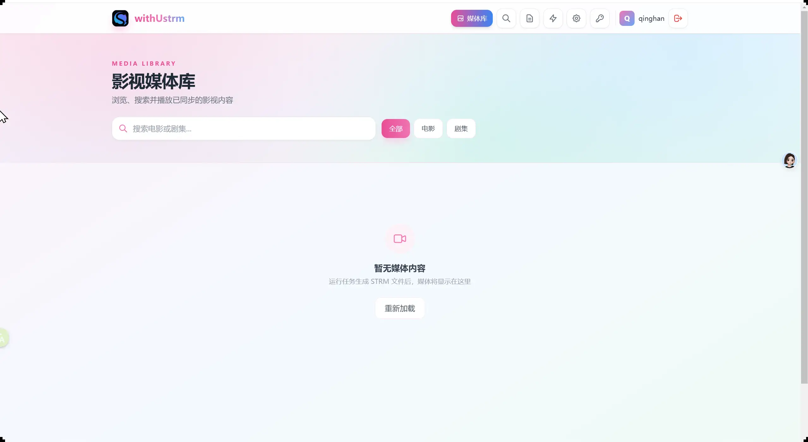
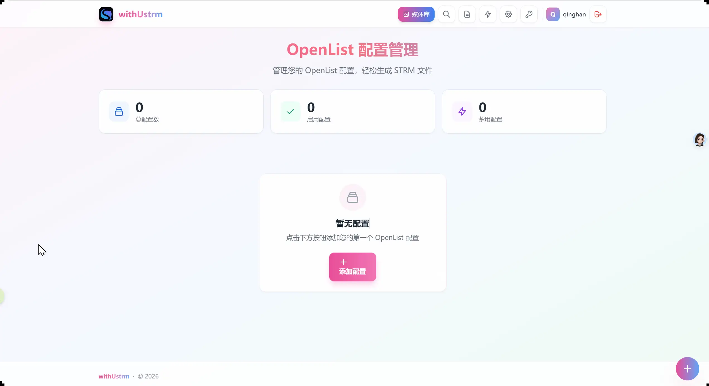

<p align="center">
  
</p>

<p align="center">
  <a href="https://github.com/Guzheng3/withUstrm/releases"></a>
  <a href="https://github.com/Guzheng3/withUstrm/stargazers"></a>
  <a href="https://github.com/Guzheng3/withUstrm/blob/main/LICENSE"></a>
</p>

<p align="center">
  <a href="#是什么">这是什么</a>
  ·
  <a href="#实际界面">实际界面</a>
  ·
  <a href="#快速开始">快速开始</a>
  ·
  <a href="#功能特性">功能特性</a>
  ·
  <a href="#二次开发说明">二次开发说明</a>
</p>

## 是什么

**withUstrm** 是一个面向 OpenList 影音库的自托管 Web 应用。它扫描远端目录，为视频生成轻量 `.strm` 文件，并可同步字幕、NFO、海报与背景图，让 Jellyfin、Emby 等媒体服务器无需搬运原始视频也能整理媒体库。

本项目基于 [OStrm](https://github.com/hienao/ostrm) 二次开发而来，在保持核心 STRM 生成能力的基础上，对界面与交互进行了重新设计与增强。

- **自动生成**：按 OpenList 原有目录结构输出 STRM 文件
- **智能整理**：可选 TMDB 刮削与 AI 文件名识别，补齐 NFO 和图片
- **持续更新**：支持 Cron 定时、增量更新、全量更新与孤立文件清理
- **媒体库联动**：任务完成后可通知 Emby 或 Jellyfin 刷新全部或指定媒体库
- **结果通知**：通过 Apprise 将任务、手动刮削和媒体库刷新结果发送到多个渠道
- **灵活适配**：支持 Base URL 替换、URL 编码控制和多个 OpenList 配置
- **媒体库可视化**：独立媒体库页面，卡片式浏览已生成的影片与剧集，详情页以海报为背景展示简介、选集与演职员
- **便于部署**：Docker Compose 一次启动，数据与输出目录持久化

## 实际界面

界面截图由 [`scripts/readme-screenshots.mjs`](./scripts/readme-screenshots.mjs) 自动截取，可在部署后随时重新生成。

| OpenList 配置管理 | 媒体库列表 |
| --- | --- |
|  |  |

## 工作方式

```text
OpenList 影音目录
      ↓ 扫描与过滤
生成 .strm 文件
      ↓ 可选处理
字幕复制 · NFO/图片复用 · TMDB/AI 刮削
      ↓
Jellyfin / Emby 等媒体库
```

首次运行可执行全量生成；后续使用增量模式和 Cron 定时任务，只处理新增或变化的内容。媒体资料按“本地已有 → OpenList 同目录 → 在线刮削”的顺序获取，减少重复请求。

## 快速开始

准备一台已安装 Docker 的设备，以及一个可访问的 OpenList 服务。创建 `docker-compose.yml`：

```yaml
services:
  withustrm:
    image: hienao6/ostrm:latest
    container_name: withustrm
    ports:
      - "3111:80"
    volumes:
      - ./data/config:/maindata/config
      - ./data/db:/maindata/db
      - ./logs:/maindata/log
      - ./strm:/app/backend/strm
    restart: always
```

启动服务：

```bash
docker compose up -d
```

打开 [http://localhost:3111](http://localhost:3111)，注册账号并完成：

1. 添加 OpenList 配置并测试连接。
2. 创建转换任务，选择源目录和 STRM 输出路径。
3. 首次执行全量生成，日常任务切换为增量更新。

## 功能特性

| 能力 | 用途 |
| --- | --- |
| TMDB / AI 刮削 | 规范媒体名称，生成 NFO、海报和背景图 |
| STRM Base URL | 为媒体服务器改写 STRM 中的访问地址 |
| URL 编码控制 | 处理中文路径、空格和特殊字符 |
| Emby / Jellyfin 刷新 | STRM 生成后刷新全部媒体库，或按媒体库 ID 精确刷新 |
| Apprise 通知 | 推送任务与手动刮削终态、失败分类和完整路径 |
| 日志与排错 | 查看任务处理链和失败原因 |

## 二次开发说明

**withUstrm 是 [OStrm](https://github.com/hienao/ostrm) 的二次开发版本**，感谢 OStrm 原作者的出色工作。

- **基础来源**：核心 STRM 生成、刮削、任务调度与通知逻辑继承自 OStrm。
- **二次开发内容**：
  - 新增独立媒体库页面（卡片式浏览、海报背景详情页、选集播放）。
  - 界面视觉全面重构，采用 Sakura Pink / Sky Blue / Leaf Green 浅色设计语言。
  - 优化媒体详情页排版：海报作为整页背景，标题、评分、播放按钮与简介等正常排版于其上。

### 技术组成

```text
Nuxt 3 + Vue 3 + Tailwind CSS
              ↓
Spring Boot + MyBatis + Quartz
              ↓
       SQLite + 文件系统
```

运行环境使用 Java 21，生产镜像由 Docker 多阶段构建并通过 Caddy 提供 Web 服务。

### 开发与部署

```bash
# 本地启动前端
cd frontend && npm install && npm run dev

# 本地启动后端（需 Java 21）
cd backend && ./gradlew bootRun
```

生产镜像构建：

```bash
docker build -t withustrm:latest .
```

### 自动截图

README 中的界面截图可自动生成，需要部署中的实例（默认 `http://localhost:3111`）与 Playwright：

```bash
npm i playwright-core
node scripts/readme-screenshots.mjs
```

输出到 `assets/readme/`，可通过环境变量 `BASE_URL` 或脚本参数指定目标地址。

## 许可证

本项目采用 [GNU General Public License v3.0](./LICENSE)。由于它基于 OStrm 二次开发，同样遵循 GPL-3.0 开源协议：你可以使用、修改和分发本项目；衍生作品需要继续采用相同许可证，并保留版权与变更说明。本项目不提供任何担保。

> 上游项目：[OStrm](https://github.com/hienao/ostrm)（GPL-3.0）
